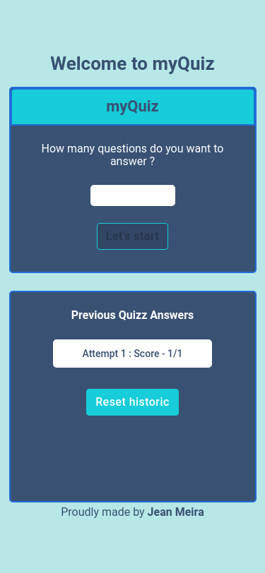
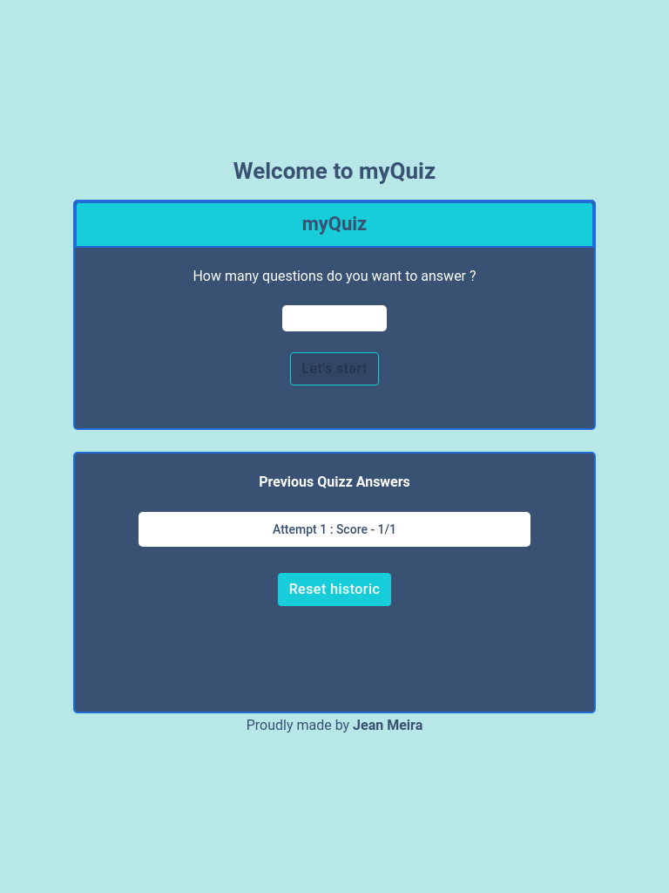
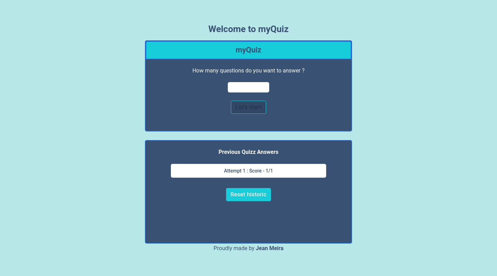
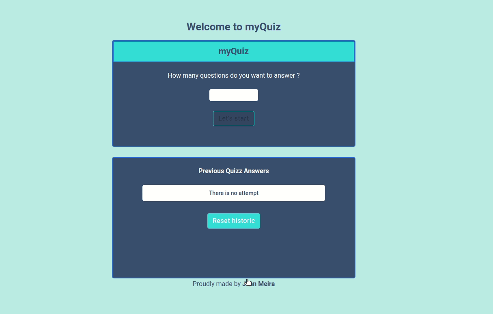

<p align="center">
  <image
  src="https://img.shields.io/github/languages/count/JCDMeira/teste-questionario"
  />
  <image
  src="https://img.shields.io/github/languages/top/JCDMeira/teste-questionario"
  />
  <image
  src="https://img.shields.io/github/last-commit/JCDMeira/teste-questionario"
  />
  <image
  src="https://img.shields.io/github/watchers/JCDMeira/teste-questionario?style=social"
  />
</p>

# 📋 Indíce

- [Proposta](#id01)
  - [O desafio](#id01.1)
    - [Requisitos não funcionais ](#id01.1.1)
    - [Requisitos não obrigatórios](#id01.1.2)
- [Screenshots](#id02)
- [Links](#id03)
- [Feito com](#id04)
- [Pré-requisitos](#id05)
- [Procedimentos de instalação](#id06)
- [Autor](#id07)

# 🚀 Proposta <a name="id01"></a>

Desafio da mentoria CSV para praticar conforme um desafio prático de processo seletivo.

A Abordagem é escolhar um desafio e completá-lo em 7 dias.

<br />

Data inicial: 14/12/2021

Data final: 20/12/2021

<br />

## :trophy: O desafio <a name="id01.1"></a>

<br />

Imagine que você foi contratado para desenvolver uma aplicação WEB para responder questionários de perguntas sobre conhecimentos gerais.

Ao acessar a página, o usuário deve escolher a quantidade de perguntas que deseja responder.

Após escolher, deve aparecer uma página com dois botões, “Start” e “Cancel”. Ao selecionar “Cancel”, deve retornar para escolher a quantidade. Ao selecionar “Start” deve fazer requisição na URL disponibilizada, pegar as perguntas e a cada pergunta, deve exibir as respostas.

O usuário deve escolher uma resposta e a cada resposta deve contabilizar quantidade de acertos e erros. Ao final, deve vir um relatório com a quantidade de acertos e erros e uma lista de cada questão e qual foi certo e qual foi errado.

Nessa lista também deve aparecer a resposta escolhida e a resposta correta. A pontuação deve ser guardada em no localStorage. Na primeira página e se houver um questionário salvo no localStorage, deve ter a possibilidade de rever o relatório.

<br />

### :dart: Requisitos não funcionais <a name="id01.1.1"></a>

<br />

É obrigatório a utilização de:

- Framework React
- Material UI
- URL para gerar as questões através do link: https://opentdb.com/api.php?amount=QUANTIDADE.
- LocalStorage para armazenar dados
- Git para versionamento
- Github para armazenar o projeto.

<br />

### :pushpin: Requisitos não obrigatórios <a name="id01.1.2"></a>

<br />
Você será bem avaliado se usar

- Context API
- Axios
- Hooks
- Formik
- testes de comportamento
- realizar um deploy em algum link.

Além disso, vamos dar uma atenção maior quando demonstrar uma boa apresentação de design e uso de design patterns (como services, repositories, factories, builders e etc)

<br />

# :camera_flash: Screenshots <a name="id02"></a>

<br />

## :iphone: Mobile design

<p  align="center">
  </img>
</p>

## :iphone: Tablets design

<p  align="center"></img></p>

## :desktop_computer: Desktop design

<p  align="center"></img></p>

## chart_with_upwards_trend result of my work

<p  align="center"></img></p>

<br />

# :heavy_check_mark: Links <a name="id03"></a>

<br />

- My figma design: [Figma](https://www.figma.com/file/Owi2kggo50lO0Czng4OrlG/projeto-teste?node-id=0%3A1)

<br />

# 🛠 Feito com <a name="id04"></a>

<br />

- Mobile-first workflow
- [React](https://reactjs.org/)
- [Styled components](https://styled-components.com)
- [Axios](https://www.npmjs.com/package/axios)
- [Formik](https://formik.org)
- [Yup](https://www.npmjs.com/package/yup)
- [Sweetalert2](https://github.com/sweetalert2/sweetalert2-react-content)
- [Material UI](https://mui.com/pt/)
- [React router dom](https://v5.reactrouter.com/web/guides/quick-start)

<br />

# ☑️ Pré-requisitos <a name="id05"></a>

<br />

- [x] Editor de código de sua preferência (recomendado VS code)
- [x] Git
- [x] Gerenciador de pacotes Yarn ou NPM

<br />

# 📝 Procedimentos de instalação <a name="id06"></a>

<br />

Clone este repositório usando o comando:

```bash
git clone https://github.com/JCDMeira/teste-questionario.git
```

Na pasta do projeto instale as dependências com uso do npm ou yarn

```bash
npm install

ou

yarn install
```

<br />

# :sunglasses: Autor <a name="id07"></a>

<br />

- Personal Page - [Jean Carlos De Meira](https://jcdmeira.github.io)
- Frontend Mentor - [@JCDMeira](https://www.frontendmentor.io/profile/JCDMeira)
- Instagram - [@jean.meira10](https://www.instagram.com/jean.meira10/)
- GitHub - [JCDMeira](https://github.com/JCDMeira)
